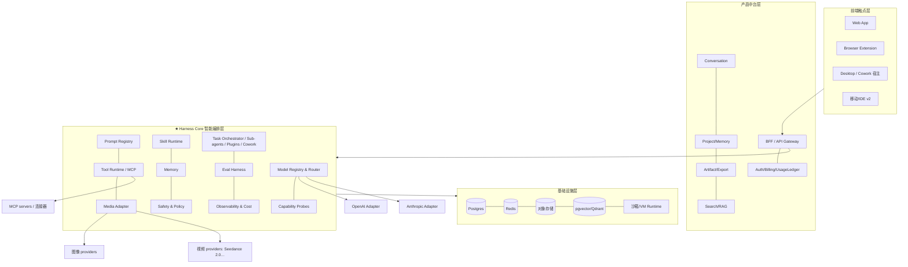

# Apolla AI — 平台工程蓝图（Harness 架构）

> 版本：v1.0　|　最后更新：2026-06-06
> 读者：**Codex / Claude Code 等 AI 编码代理**与工程师。
> 配套：[PRD](./PRD.md) · [开发计划](./DEVELOPMENT_PLAN.md) · [CLAUDE.md](../CLAUDE.md) · [AGENTS.md](../AGENTS.md)
>
> 本文是把前述所有结论（PRD §0–16、开发计划、OpenClaw/Hermes 借鉴、多媒体生成、Monica/Genspark 能力、Cowork 模式）**收敛成单一工程蓝图**的总纲。任何编码前先读本文第 1、3、9 章。

---

## 0. 给 AI 编码代理的总纲（先读这段）

- **平台 = Harness + 可插拔能力**。你写的几乎所有代码，都是往 Harness Core 注册一个**能力**（模型 / 工具 / 技能 / 媒体 provider / 连接器 / 策略），而不是把逻辑焊死在某个模型或某个页面里。
- **永远不要硬编码模型名、不要内联 Prompt、不要绕过策略引擎、不要让外部内容进指令通道**（详见 §1.3 反模式）。
- **每加一个能力，必须同时加一个 eval 用例**（§3.10）。能力没有 eval = 没有交付。
- **改动落到注册表/适配器/配置，而不是散落的 if-else**。新增一个模型/工具/技能应是"加一个适配器 + 一行配置"，不是改业务代码。
- 不确定时**停下来问**（对齐 Cowork 的澄清原则，§PRD 15.3），不要猜测性地做不可逆动作。

---

## 1. 核心理念：Harness 架构

### 1.1 一句话
**Apolla AI 是一个 harness（模型外的薄编排层）：把 GPT/Claude 及图像/视频/语音模型当作可替换、持续变强的"能力提供者"，平台自身只负责"路由、上下文、工具、记忆、安全、评测、交付"。** 当底层模型变强，平台能力**自动随之变强**，无需重写产品代码。

> 公式心智：**平台能力 ≈ 模型能力 × Harness 杠杆**。我们的工程价值在"杠杆"，不在重复模型已经会做的事。

### 1.2 四条架构公理（不可违背）
1. **模型前向（Model-forward）**：默认信任并调用模型能力；只在评测证明必要时才加 scaffolding。**不要为模型当前的暂时缺陷过度搭脚手架**——下一个模型可能就修好了，脚手架会变成负债。
2. **能力即配置（Capability as config）**：模型、Prompt、工具、技能、媒体 provider、连接器、策略，全部**注册表 + 版本化 + 灰度 + 回滚**，运行时按配置装配。
3. **升级即换挡（Upgrade by swap）**：升级模型/Provider = 改注册表别名映射 + 过 eval + 灰度。绝不改调用方业务代码。
4. **评测即安全网（Evals as the net）**：每个能力都有 golden 用例；模型/Prompt/工具任何变更都必须先过 eval 回归（含质量、引用正确性、成本、工具成功率、安全）。

### 1.3 反模式清单（Codex/Claude Code 必须避免）
- ❌ 在业务里写 `if model == "gpt-5.4"` 或直接 `openai.chat(model="...")` → ✅ 走 Model Router 别名。
- ❌ 把 Prompt 字符串内联进函数 → ✅ 进 Prompt Registry，按 `prompt_id@version` 取。
- ❌ 为"模型不会做 X"写死一长串规则脚手架，且无开关 → ✅ 用能力探针 + 特性开关，模型变强即可一键退役脚手架（§3.2）。
- ❌ 把网页/文件/工具返回内容拼进系统指令 → ✅ 走数据通道（§3.8 不可信输入）。
- ❌ 新增工具时直接在 orchestrator 里加分支 → ✅ 实现 Tool 适配器并在注册表登记。
- ❌ 高风险动作直接执行 → ✅ 过 Safety & Policy Engine 分级确认。
- ❌ 交付能力却不加 eval / 不接 Cost Ledger → ✅ 能力、eval、计费三件套同时交付。

---

## 2. 架构总览（四层 + Harness Core）



> **Harness Core 是本平台的工程重心**。中台/触点/基础设施都是常规工程；真正的杠杆在 Core 的注册表与编排。

**前端触点层（Sprint 09，已落地 Web App）**：`apps/web`（Vite + React + TS SPA）是面向用户的生产前端——纯 API 客户端，通过类型化客户端 + SSE hook 消费 BFF 的 HTTP/SSE 接口，**不旁路 BFF、不直连模型/库、不持密钥**（鉴权走会话 cookie），Markdown 安全渲染。BFF（`apps/bff`，刻意独立的 Node 服务）仍是唯一后端与组合根；其内联工作台保留为零配置兜底。SSR/营销站、桌面宿主、扩展、移动端为后续触点。

---

## 3. Harness Core 模块规格（含接口契约）

> 接口以 TypeScript 伪代码表达意图，不约束具体实现语言（TS BFF + Python AI Workers 均可）。**所有适配器实现统一接口 → 可热插拔。**

### 3.1 Model Registry & Router
职责：逻辑别名 → 具体模型映射；failover 链；多密钥轮换；OAuth 订阅；结构化输出；流式。

```ts
type ModelAlias = 'gpt_fast'|'gpt_premium'|'claude_write'|'claude_premium';
interface ModelDescriptor {
  id: string;                 // provider/model-id，仅存于注册表，业务层不可见
  provider: 'openai'|'anthropic'|string;
  caps: ModelCaps;            // 见 §3.2 能力声明
  costPer1k: { in: number; out: number };
  contextWindow: number;
  supportsStructuredOutput: boolean;
  supportsPromptCache: boolean;
}
interface RouteConfig {
  alias: ModelAlias;
  primary: string;            // ModelDescriptor.id
  fallbackChain: string[];    // 顺序回退：可用性/速率/成本
  keyPool: string[];          // 多密钥轮换
}
interface ModelRouter {
  complete(alias: ModelAlias, req: LLMRequest): AsyncIterable<LLMChunk>; // 默认流式
  json<T>(alias: ModelAlias, req: LLMRequest, schema: JSONSchema): Promise<T>;
}
```
- 默认路由表见 [PRD §6.1](./PRD.md)。失败降级：高阶失败 → 回退轻量 + 缩上下文 + 只读。
- **新增模型** = 加一个 `ModelDescriptor` + 改 `RouteConfig` + 过 eval。不改调用方。

### 3.2 Capability Probes & Progressive Enhancement（"随模型增强"的关键机制）
这是"平台随模型变强而变强"的核心。每个模型在注册时声明能力，并由探针定期评测校准：

```ts
interface ModelCaps {
  toolUse: boolean; parallelToolUse: boolean;
  longContext: number; vision: boolean; reasoningDepth: 0|1|2|3;
  structuredReliability: number; // 0..1，由探针 eval 校准
  agenticReliability: number;    // 多步任务成功率
}
interface FeatureGate {
  feature: string;               // 如 'auto_skill_write' | 'multi_tool_plan' | 'a2ui'
  requires: Partial<ModelCaps>;  // 满足才启用
  scaffold?: ScaffoldRef;        // 模型不达标时挂载的"脚手架"（补偿逻辑）
}
```
- **渐进增强**：特性根据当前别名映射模型的 `caps` 自动启用/降级。模型升级 → 探针重测 → `caps` 提升 → 更多特性自动解锁、对应 scaffold 自动退役。
- **脚手架可退役**：所有为补偿模型缺陷写的逻辑都挂在 `FeatureGate.scaffold` 后面，带开关；不允许散落在业务里（呼应公理 1）。
- 探针套件随 Eval Harness 一起跑（§3.10）。

### 3.3 Prompt Registry
```ts
interface PromptVersion {
  promptId: string; version: string; scene: string;
  template: string; inputSchema: JSONSchema; outputSchema?: JSONSchema;
  safetyConstraints: string[]; evalSet: string; rollout: number; rollbackTo?: string;
}
```
- 取用：`registry.get(promptId, {pin?: version})`；灰度按 `rollout`。
- Prompt 同样是"声明式资产"，与 Skill（§3.6）同源管理。

### 3.4 Tool Runtime（以 MCP 为统一标准）
```ts
interface Tool {
  name: string; risk: 'read'|'low_write'|'high_write'; // 对接 §3.8 分级
  schema: JSONSchema; invoke(args, ctx): Promise<ToolResult>;
  source: 'native'|'mcp';
}
interface ToolRuntime {
  register(tool: Tool): void;
  connectMCP(server: MCPServerConfig): Promise<Tool[]>; // 外部工具优先 MCP 接入
  list(filter): Tool[];
}
```
- 外部工具/数据源优先 MCP（[PRD §12.C](./PRD.md)）。内部工具也以 Tool 接口注册。
- 工具调用受 §3.8 沙箱与权限约束。

### 3.5 Media Adapter（图像/视频，含 Seedance 2.0）
```ts
type MediaAlias = 'image_fast'|'image_premium'|'video_standard'|'video_premium';
interface MediaAdapter {
  submit(job: MediaJob): Promise<JobId>;
  poll(id: JobId): Promise<JobStatus>;          // 或 webhook 回调
  fetchResult(id: JobId): Promise<Asset[]>;     // 转存对象存储
  capabilities(): MediaCaps;                    // 分辨率/时长/宽高比/参考图/运镜…
  estimateCost(p: MediaParams): Cost;
}
```
- 视频一律异步任务对象 + 成本预估 + 生成前后内容审核（[PRD §13](./PRD.md)）。
- **新增 provider**（如 Seedance 2.0 / Kling / Veo）= 实现 `MediaAdapter` + 注册别名映射。

### 3.6 Skill Runtime（声明式 + 闭环自动写）
```ts
// Skill = 带 frontmatter 的 Markdown，兼容 agentskills.io
interface SkillDef {
  name: string; triggers: string[]; tools: string[];
  io: { input: JSONSchema; output?: JSONSchema };
  risk: RiskLevel; promptRef: string; // 指向 Prompt Registry
}
interface SkillRuntime {
  load(ctx): SkillDef[];                 // 按任务相关性注入
  autoDraft(task: CompletedTask): SkillDef | null; // 闭环：高质量任务后自动起草
}
```
- 闭环自动写 Skill（[PRD §12.A](./PRD.md)）：任务被点赞/导出/分享后，`autoDraft` 产出可复用 Skill，用户审阅保存。
- Plugin = Skills + 连接器 + slash 命令 + 子代理 的角色化捆绑（[PRD §15.2](./PRD.md)）。

### 3.7 Memory
- 三层：会话级 FTS 检索 + LLM 摘要；结构化用户模型（USER 档案）；memory nudging 按相关性注入（[PRD §12.B](./PRD.md)）。
- 全量受数据控制：可见/可编辑/可删除/可关闭（[PRD §8](./PRD.md)）。

### 3.8 Safety & Policy Engine
- **三级权限**：只读（自动）/ 低风险写入（显式确认）/ 高风险写入（MVP 不做；后续强制二次确认）。失败自动切只读。
- **不可信输入防护**：外部内容（网页/文件/工具/MCP/连接器返回）走**数据通道**而非指令通道；由不可信内容触发的动作强制确认（[PRD §12.E](./PRD.md)）。
- **沙箱/VM**：代码执行 / Artifact 运行 / 浏览器动作 / Cowork 任务在容器或 VM 隔离，按任务 allowlist（[PRD §12.D / §15.3](./PRD.md)）。
- **按工具连接器开关**、RBAC、花费上限（企业，[PRD §15.4](./PRD.md)）。

**安全周界（Sprint 10，已落地）** —— 把内核安全延伸到服务边界：
- **真实鉴权**：邮箱+密码（scrypt 哈希 + 每用户盐 + 定时安全比较，绝不明文/入日志）；**服务端会话**（`SessionRepository`，签名 httpOnly cookie 携带随机会话 id，过期 + 登录轮换 + 登出失效，生产 `Secure`）。demo 模式保留零配置邮箱登录，由 `AUTH_MODE`/`NODE_ENV` 切换，不削弱生产默认。
- **多租户隔离（防 IDOR）**：每个取 `:id`/path/SSE/确认的端点都校验 `ownerId === 会话用户`，跨租户 **fail-closed**（404，不泄露存在性）；S10 审计修复了 4 处仅按 id 解析的 in-process pending map（研究/agent/媒体任务 + agent 确认）。
- **限流**（`RateLimiter` 令牌桶）：per-IP（含登录/注册）+ 昂贵 LLM/媒体端点 per-owner；429 + `Retry-After`。
- **周界**：安全响应头（CSP/nosniff/frame-deny/referrer）、CORS 白名单（`CORS_ORIGIN`）、请求体上限（413）。
- **可观测性**：`Metrics`（计数 + 延迟直方图）→ `GET /metrics`（仅聚合数字）；每请求 `x-request-id` + 脱敏结构化访问日志（绝不含密码/cookie/令牌）。
- **韧性**：启动 `reconcileJobs` 把残留 `queued`/`running` Job 标 `interrupted`（终态）；`SIGTERM` 优雅停机（停 cron、drain server、关连接池）。

### 3.9 Task Orchestrator（任务对象 / 子代理 / Plugins / Cowork）
```ts
interface Task {
  id: string; type: TaskType; state: 'plan'|'search'|'extract'|'compare'|'generate'|'deliver'|'done'|'failed';
  steps: Step[]; cost: CostLedgerRef; artifacts: ArtifactRef[];
  replayable: true; ownerId: string; projectId?: string;
}
interface Orchestrator {
  run(task: Task): AsyncIterable<TaskEvent>;     // 异步、可回放、可计费
  spawnSubAgent(spec): SubAgentHandle;           // 并行分工（Cowork）
  schedule(cron, task): ScheduledTask;           // 定时/后台自治
}
```
- 每个用户任务 = 一个**可观察、可计费、可回放、可归档**的 Task 对象。
- 长任务异步 + 计划草图 + 阶段进度 + 预估成本/耗时。
- Cowork 模式（[PRD §15](./PRD.md)）= Orchestrator 在沙箱中后台自治 + 子代理 + Plugins + 连接器 + 桌面文件工作区 + 主动澄清。

**Cowork 实现（Sprint 06，已落地）** —— 三块拼装在已有 harness 上，不另造运行时：
- **Plugins**（`Plugin` 契约 + `PluginRepository` + `CompositeSkillSource`）：角色化能力包，打包 `skills` + 所需连接器 + 命令别名；按 owner 安装即把其 skills 并入该用户可用技能（match/run），卸载即移除；官方包声明在 `config/plugins/*.json`，新增无需改业务代码。
- **子代理编排**（`Coordinator`）：把目标 fan-out 给一个 subgoal 一个**有界子代理**——每个子代理就是一次完整 `AgentOrchestrator` 运行，因此**继承 Safety 三级 + 审计 + 后台 approve 策略**；`maxSubAgents`（总量）+ `concurrency`（并发）双重硬上限防失控，超限钳制并上报 `truncated`；汇总成单一交付。事件 `plan/subagent-start/subagent-result/synthesize/done` 可回放。
- **集成式 `CoworkOrchestrator`**：规划 subgoals（LLM 结构化）→ 驱动 Coordinator。`cowork` 是一种 `JobKind`，因此 Cowork 直接复用 Sprint 05 的 JobRunner（前台 SSE / 后台 / 定时）+ 通知 + 配额闸（`JobRunner.canRun`）。
- **澄清**（`clarify(question)` 解析器，贯穿 Agent→Coordinator→Cowork）：不确定/不可逆前主动提问；**后台无人 → 返回 null → 安全降级（best-effort），绝不自答**。

**Workspace & Files（Sprint 07，已落地）** —— 把一次性产出升级为持久、可版本、可编辑、可组合的工作产物（虚拟 FS，非裸机目录）：
- **版本化文件区**（`WorkspaceRepository`，内存 + Postgres）：写入**追加新版本**（只增不改），读最新/指定版、列文件树、历史、回滚（= 用旧版内容产生新版本，保留完整历史）；按 **owner+project 隔离**。
- **路径安全**（`normalizeWorkspacePath`，工具层 + repo 层双重）：拒 `..`、绝对路径、控制字符/反斜杠、跨 scope——**路径遍历是文件区头号风险**。
- **文件感知工具**（`fs_read`/`fs_list` = read，`fs_write` = low_write）：接入 ToolRuntime，受 Safety 三级 + Agent/Cowork 的 approve/allowlist 约束；**读到的文件内容进 untrusted 数据通道**（与工具输出一视同仁，不当指令）。
- **Writer**（`WriterOrchestrator`）：读工作区文档（数据通道）→ LLM 按指令编辑 → 写新版本（旧版保留 → 可回滚）。
- **Cowork 文件协作**：`Coordinator` 可选挂 workspace——授权时（镜像 fs_write allowlist，后台安全）子代理各节落 `cowork/<id>/sections/<i>.md`，汇总读回拼 `cowork/<id>/brief.md`。
- **配额 + 审计**（`GuardedWorkspaceRepository` 装饰器）：每 owner 文件数 + 总字节上限，超限拒写；**每次写入（含越界拒绝）落审计**。

**Text Product Surfaces（Sprint 08，已落地）** —— 在工作区之上落地 Monica/Genspark 式文本面，但用统一 substrate（capability-as-config），新增面 ≈ 配置 + executor：
- **Surface substrate**（`Surface` 契约 + `SurfaceRuntime` + `config/surfaces/*.json`）：声明 inputKind（text|doc）+ params + promptRef + outputMime + executor；Runtime 解析输入（doc 经 workspace 读入数据通道）→ 分派 executor → 产物经（Guarded）workspace 写回。复用 Prompt Registry + Router + Workspace + Cost。
- **翻译**（`translate` executor）：文本/文档 → 目标语言译文，保 Markdown 结构（流式）。
- **表格**（`sheet` executor）：`generate`（提示 → 结构化表，`router.json` + zod）/`addColumn`（已有 CSV → AI 补一列，行数不变 → 新版本）/`summarize`；CSV 编解码。
- **会议纪要**（`notes` executor）：转写 → 结构化 `{summary, decisions[], actionItems[{owner,task,due}]}`（zod）→ Markdown。
- **健壮性/安全**：输入是 untrusted 数据；产物只走工作区 guard（路径/配额/审计）；**结构化输出 zod 校验失败 → 安全降级，不写半成品**；每次 LLM 调用计入 Cost Ledger。

### 3.10 Eval Harness（升级安全网）
五类回归（每次模型/Prompt/工具/媒体变更必跑）：
1. Golden set 质量回归 2. Citation correctness 3. Cost regression 4. Tool success regression 5. 安全（prompt 注入对抗 / 沙箱逃逸 / 越权动作）。
- 媒体专项：MediaAdapter contract、成本预估准确性、内容审核拦截、视频异步失败回退。
- 能力探针（§3.2）随此套件跑，回写 `ModelCaps`。

### 3.11 Observability & Cost Ledger
四看板：业务 / 质量 / 成本 / 技术（[开发计划 §6](./DEVELOPMENT_PLAN.md)）。OpenTelemetry 接入（企业）。每次模型/工具/媒体调用写 UsageLedger（token、$、provider、cache hit）。

---

## 4. 升级与维护手册（给 AI 代理的标准操作）

| 我要做什么 | 标准动作（只动这些） | 必过 |
|---|---|---|
| 升级 / 替换一个 LLM | 加 `ModelDescriptor`，改 `RouteConfig.primary/fallbackChain`，重跑能力探针 | Eval 五类回归 |
| 接入一个外部工具/连接器 | 实现 `Tool` 或 `connectMCP(server)`，登记 risk 级别 | Tool success + 安全 eval |
| 新增一个 Skill | 写 `SkillDef` Markdown + Prompt Registry 条目 | Golden 用例 |
| 新增媒体 provider（如新视频模型）| 实现 `MediaAdapter` + 媒体别名映射 | Media contract + 成本/审核 eval |
| 模型变强后退役脚手架 | 关闭对应 `FeatureGate.scaffold` 开关；探针确认 `caps` 达标 | 回归无退化 |
| 新增 Plugin（Cowork）| 声明 Skills+连接器+命令+子代理 捆绑 + 权限清单 | 安装授权流 + 安全 eval |

> 维护铁则：**新增能力的 diff 应集中在"一个适配器 + 一段配置 + 一个 eval"**；若你发现自己在 orchestrator/业务层加分支，停下来——多半放错了层。

---

## 5. 能力总表 → PRD 溯源（每个功能挂到 Harness 注册点）

| 能力 | Harness 注册点 | PRD | 版本 |
|---|---|---|---|
| 统一聊天 / Auto-GPT-Claude | Model Router | §6.1 | MVP |
| Web Research / 引用 | Orchestrator + Tool(Search) + Prompt | §6.2 | MVP |
| 文件理解 / RAG | RAG + Tool(Parser) | §6.3 | MVP |
| Projects | Project/Memory | §6.4 | MVP |
| Artifact / A2UI | Artifact + Skill | §6.5 / §12.G | MVP/v1 |
| Docs/Slides 导出 | Export Service | §6.6 | MVP |
| 浏览器侧边栏 | Ext + Tool(DOM) | §6.7 | MVP |
| 不可信输入防护 | Safety & Policy | §12.E | MVP |
| 沙箱执行 | Sandbox Runtime | §12.D | MVP→v1 |
| 上下文压缩 / slash | Orchestrator + 指令 | §12.F | MVP→v1 |
| Memory（FTS+摘要+用户模型）| Memory | §12.B | v1 |
| Custom Skills + 闭环自动写 | Skill Runtime | §12.A | v1 |
| Browser Actions（分级）| Tool + Safety | §7 | v1 |
| 定时/后台任务 | Orchestrator.schedule | §5 | v1 |
| 文生图/视频（Seedance 2.0）| Media Adapter | §13 | v1 |
| 翻译/Writer/Sheets/Meeting/AI Developer | Skill + Tool + Export | §14 | v1 |
| MCP 连接器 / 市场 | Tool Runtime(MCP) | §12.C/§14 | v1/v2 |
| 可视化 Workflows | Orchestrator(DAG) | §14 | v2 |
| 多端 / 语音 / Open API | Touch 层 / Adapter | §14 | v2 |
| 团队治理 / 企业管控 | Auth + Safety(RBAC) | §14.3/§15.4 | v2 |
| **Cowork 模式（Plugins+子代理+桌面+澄清）** | Orchestrator + Skill + Tool + Safety | §15 | v2 |

---

## 6. 核心数据模型（最小集）
`User · Project · Conversation · Message · Task · Step · Artifact · Source/Citation · UsageLedger · PromptVersion · SkillDef · ModelDescriptor · RouteConfig · MemoryItem · ScheduledTask · Plugin`。
- **Task 是中枢**（§3.9）：状态机 + steps + cost + artifacts + replayable。
- 全部按 `ownerId` 隔离；支持导出/删除（§8）。

---

## 7. Monorepo 布局（建议）
```
apolla/
  apps/
    bff/                 # ★ 独立 Node BFF：HTTP/SSE API + 组合根 + 内联工作台（唯一后端）
    web/                 # ★ 生产前端：Vite + React + TS SPA，消费 BFF（Sprint 09，已落地）
    extension/           # MV3 浏览器扩展（后续）
    desktop/             # 桌面 / Cowork 宿主（后续）
  packages/
    harness-core/        # ★ Model Router / Prompt Registry / Tool Runtime / Media / Skill / Memory / Safety / Orchestrator / Eval
    adapters/
      llm/openai/  llm/anthropic/
      media/seedance/ media/...
      mcp/             # MCP 客户端与连接器
    contracts/           # 共享类型/JSONSchema（前后端 + Python worker 共用 schema）
    config/              # 注册表配置：routes / prompts / skills / feature-gates
  workers/
    ai-workers/          # Python AI Workers（重编排/媒体/RAG）
  evals/                 # golden sets / 探针 / 安全对抗用例
  infra/                 # IaC / CI / 观测
```
- `harness-core` + `adapters` + `config` 是平台杠杆所在，代码评审与 eval 要求最高。
- `contracts/` 用 JSONSchema 作为 TS 与 Python 的单一事实源，跑 Provider Contract Test。

---

## 8. 构建顺序（Harness-first，对齐开发计划）
1. **阶段0**：冻结数据模型 + 注册表 schema（Model/Prompt/Tool/Media/Skill/FeatureGate）+ 任务对象 + 埋点。**先立 Harness 骨架，再写功能。**
2. **阶段1**：Harness Core 可用（Router+failover、Prompt Registry、Tool Runtime+MCP 骨架、Safety、Sandbox、Eval 骨架、Cost Ledger）。
3. **阶段2（MVP）**：研究→成品闭环 + 侧边栏 + 不可信输入防护 + 上下文压缩，全部走 Harness。
4. **阶段3 Beta**：Eval 套件 + 安全策略 + 私测硬化。
5. **阶段4 V1**：Memory、闭环 Skill、Browser Actions、媒体（Seedance）、翻译/Writer/Sheets/Meeting/AI Developer、A2UI。
6. **阶段5 / v2**：Workflows、多端、语音、Open API、团队治理、**Cowork 模式整合**。

> 详见 [开发计划](./DEVELOPMENT_PLAN.md)；本文只强调**顺序铁律：Harness Core 与注册表先于任何具体功能**。

---

## 9. 给 Codex / Claude Code 的工作约定

1. **动手前**读：本文 §1/§3/§4 + [PRD](./PRD.md) 对应 § + [开发计划](./DEVELOPMENT_PLAN.md) 对应阶段 checklist。
2. **任务最小单元** = 开发计划里的 `[ ]`。一次只推进一项，自带 eval。
3. **每个功能的实现顺序**：数据模型/Schema → 适配器/注册 → 编排 → UI。
4. **新增模型调用**必经 Router + Prompt Registry；**新增工具**必经 Tool Runtime；**新增媒体**必经 Media Adapter。禁止旁路。
5. **改动应集中在 `harness-core` / `adapters` / `config` / `evals`**；若 diff 大量落在业务/UI 层做能力补偿，多半违反公理 1，停下来重审分层。
6. **写完即验证**：跑相关 eval 与 contract test；接 Cost Ledger；确认未把外部内容引入指令通道。
7. **不确定/不可逆** → 按 Cowork 澄清原则停下来问，不要猜测执行（尤其 §3.8 高风险动作）。
8. **提交说明**写清：动了哪个注册点、加了哪个 eval、是否涉及 FeatureGate/脚手架变更。

---

## 10. Definition of Done（每个能力的验收）
- [ ] 通过统一适配器/注册表接入，**无硬编码模型名/内联 Prompt**。
- [ ] 有 golden eval 用例，且五类回归无退化。
- [ ] 受 Safety & Policy 约束（权限分级 + 不可信输入 + 沙箱，按适用）。
- [ ] 调用计入 Cost Ledger，成本可见。
- [ ] 若为模型缺陷补偿逻辑，挂在 `FeatureGate.scaffold` 且带退役开关。
- [ ] 文档/Schema 更新；contract test 通过。

---

## 11. 技术栈与命令
- 栈（目标）：Next.js + TS（web/ext/desktop）｜ TS BFF ｜ Python AI Workers ｜ Postgres / Redis / 对象存储 / pgvector|Qdrant ｜ Docker + serverless（Modal/Daytona 式）沙箱。
- 栈（Sprint 01 现状）：pnpm workspaces + TS（严格）｜ 独立 Node BFF（`apps/bff`，tsx）｜ Repository 内存实现（Postgres 留接口）｜ fetch-based provider 适配器（无 SDK 依赖）。
- 命令：

| 命令 | 作用 |
|---|---|
| `pnpm dev` | 启动 Demo BFF（`apps/bff`）→ http://localhost:3000 |
| `pnpm typecheck` | 全包 TS 类型检查 |
| `pnpm lint` | ESLint |
| `pnpm test` | vitest 单测（含离线端到端 demo） |
| `pnpm build` | 各包 tsc 产物 |
| `pnpm eval` | 研究 golden + 引用正确性 + 成本回归 |
| `pnpm contract-test` | Provider 契约测试 |

CI 对每个 PR 跑 typecheck · lint · test · build · eval 全门禁。

> 维护本文：当新增一类能力（新的 Adapter 种类、新的注册点、新的安全级别）时，更新 §3、§4、§5。功能级细节放 PRD，编排与升级机制放本文。
